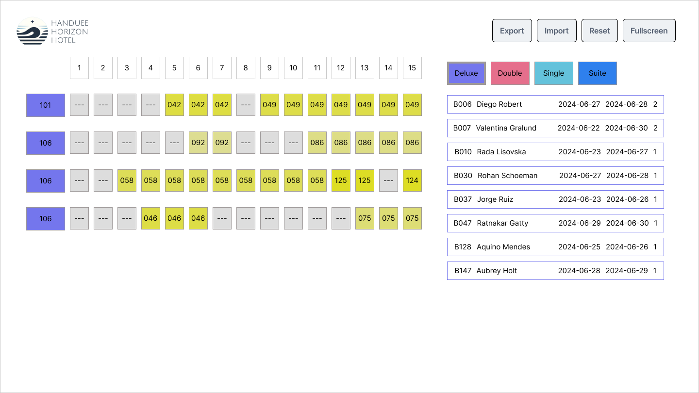

# ws2024-s17-kr-module-f - JS Browser API - Haeundae Horizon Hotel Room Assignment Tool

## Introduction

Haeundae Horizon Hotel is a luxurious four-star hotel located near the picturesque Haeundae Beach. To enhance the efficiency of room management, the hotel is developing an interactive tool to help officers assign rooms to bookings seamlessly. As part of a competitive event, participants are required to create a prototype of this tool.

You are tasked with creating a prototype of an interactive tool that helps hotel officers assign rooms to bookings. The prototype is limited to handling bookings for June 2024. The tool should display a calendar view, manage room assignments, and provide functionalities such as filtering by room type, drag-and-drop booking assignments, and exporting/importing assignments.

Original data should be fetched from the provided backend using the following endpoints: 
- `http://hh-hotel.kr/api/v1/rooms`
- `http://hh-hotel.kr/api/v1/bookings`

Alternatively, `rooms.json` and `bookings.json` will be provided in case you can't fetch from the server.

There are following sections in the page:

- Room type filtering
- Unassigned bookings list area
- Calendar with bookings
- Fullscreen button
- Reset button
- Export button
- Import button

## Description of Project and Tasks

### Calendar View

- Display a calendar view showing 15 days at a time. Initially, show the interval from June 1 to June 15.
- In the header, the numbers of the days are displayed.
- After the header, each row of the calendar represents a room in the hotel, and each cell represents a possible assignment of a booking to that room for a day.
- Each line starts with a room ID. The background color of the room ID should match the corresponding room type button's background color.
- Day boxes with assigned booking should display the last three characters of the booking ID. Day boxes with assigned booking background color should be `#DDXDYD`, where `XY` are the last two digits of the booking ID. (E.g booking code: `B125`, background color code: `#DD2D5D`). Day boxes without assigned booking show `---` string.
- Clicking on a day in the calendar header adjusts the view to center around the selected day.
  - Days 1-7: Show June 1-15.
  - Days 24-30: Show June 16-30.
  - Other days: Center the selected day in a 15-day interval.
- If the check-out date of one booking and the check-in date of another booking fall on the same day for the same room, both booking IDs should be displayed in the cell in vertical order.

### Room Type Filtering

- Allow filtering of room types with buttons on the right side of the screen.
- Display only bookings for the selected room type in the calendar view and the unassigned booking list.
- Deluxe is selected initially.
- The currently selected room type button has a thicker border.

### Unassigned Booking List

- Display a list of bookings that are not yet assigned to any room.
- Each unassigned booking should display the following details:
  - Booking ID
  - Guest name
  - Check-in date
  - Check-out date
  - Number of guests
- The border of the unassigned bookings should have the same color as the corresponding room type button.
- Clicking an unassigned booking centers its interval in the calendar view. If the booking interval is an odd number of days, one less day should be displayed before the check-in date than after the check-out day. Bookings longer than 15 days don't have to be supported.

### Drag and Drop Functionality

- Allow dragging unassigned bookings to room rows in the calendar.
- Enable drop only if the room is free during the booking interval.
- Successful drop displays the booking ID in the calendar and removes it from the unassigned list.
- Dragging a booking from the calendar to the unassigned list area unassigns the booking. The booking can be grabbed using any of the associated cells. If two booking IDs appear in a cell, you can grab the booking whose check-in date falls on that day. Successful drop displays the booking in the unassigned list and remove it from the calendar.
- Provide visual feedback for drag-and-drop actions.

### Reset Button

- Reset the tool to its original state based on data fetched from the backend.

### Persistent State

- Store changes in the browser to retain the state after page refresh or browser restart.

### Clipboard Copy

- Clicking on a day box with a booking copies the booking details to the clipboard.

### Export/Import Functionality

- Export current room assignments to a CSV file in the format: `bookingId,roomId` when the officer clicks the Export button. The filename should be `hhh-bookings.csv`.
- Import room assignments from a CSV file with the same format, overwriting current assignments.

### Fullscreen Mode

- When the user clicks the fullscreen button, toggle the fullscreen view of the browser window.
- While in fullscreen mode, if the user clicks the exit fullscreen button or presses the ESC key on the keyboard, the fullscreen view will end, and the browser will return to the normal web page view

## Instructions to the Competitor

- All assessment is done on the server. No assessment process is performed on the workstation.
- You should consider the quality of your code.
- You should consider the accessibility of your application.
- Follow the provided design layout closely, although design implementation is not a key evaluation aspect.
- Ensure your tool meets the described functionality and interaction requirements.
- Focus on creating a user-friendly and responsive interface.
